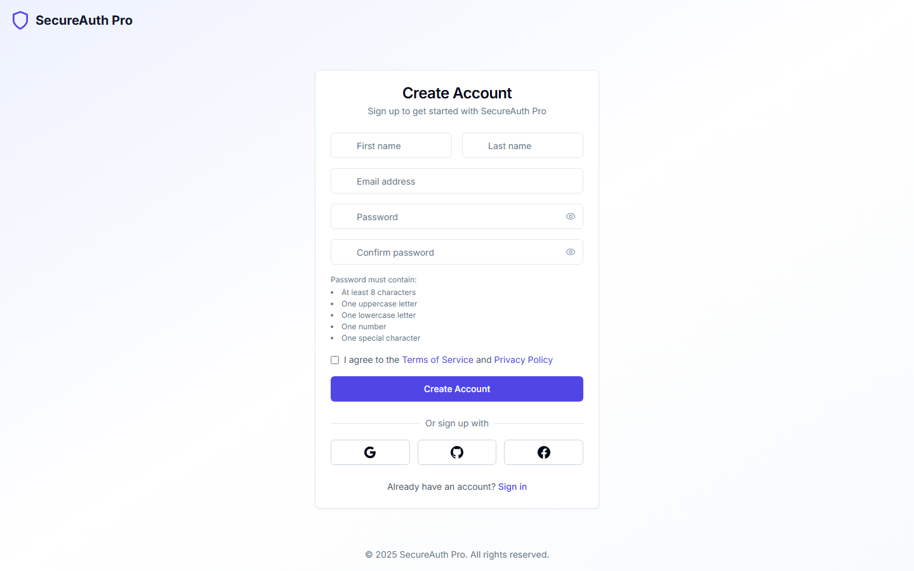
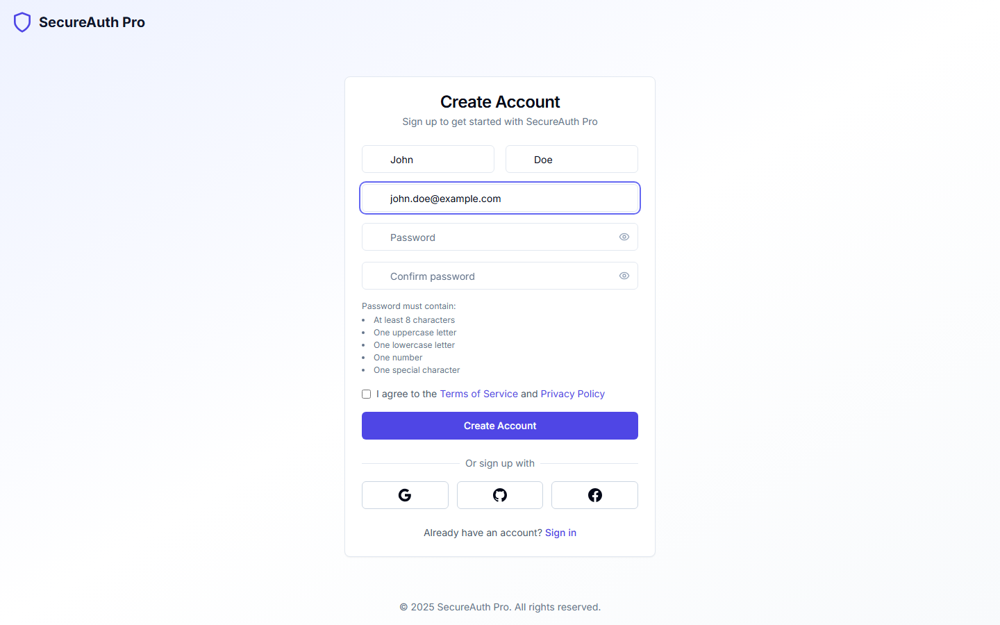
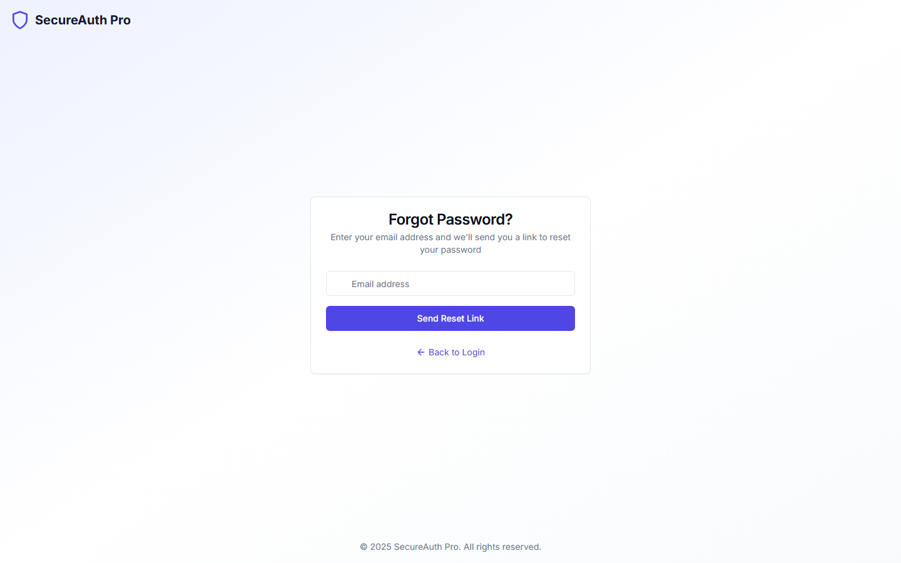
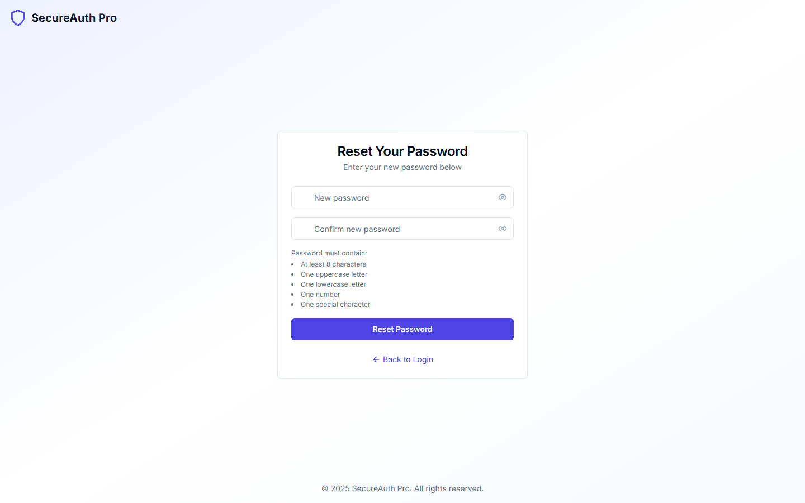
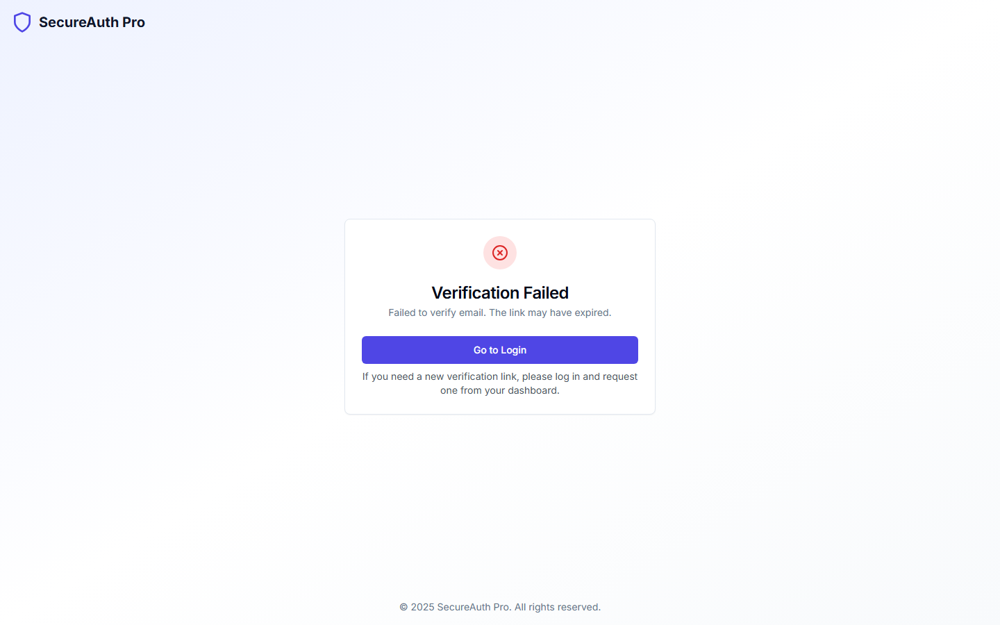
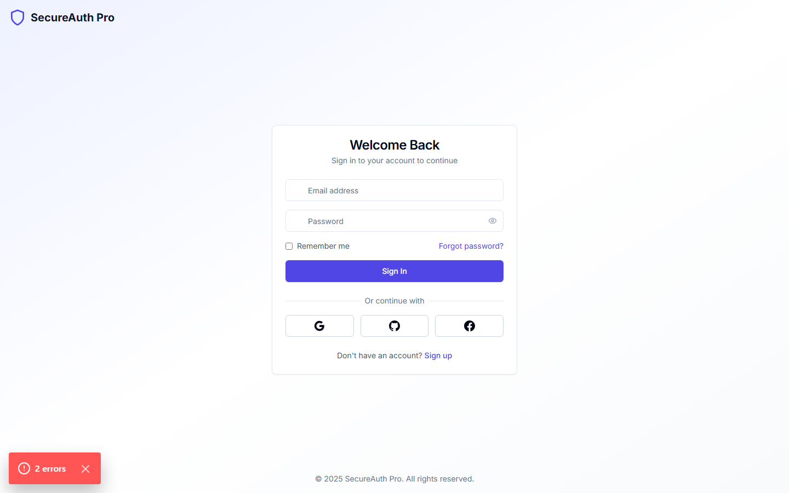
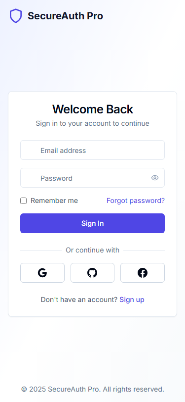
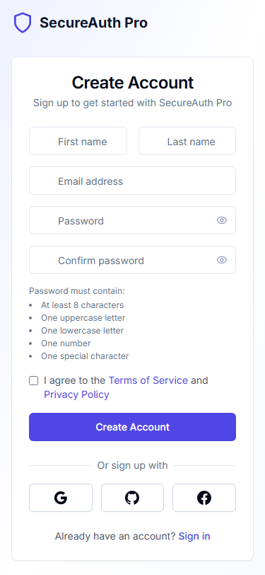
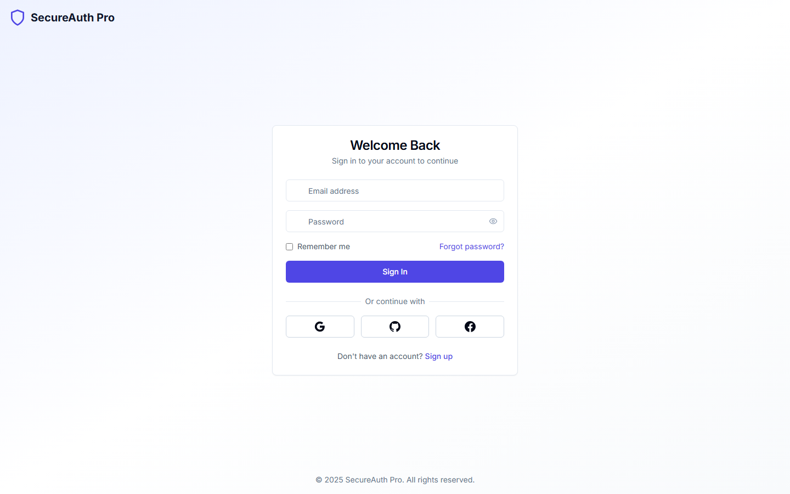

# SecureAuth Pro - Screenshots Gallery

This document showcases all the pages and features of SecureAuth Pro authentication system.

---

## Authentication Pages

### Login Page
Clean and modern login interface with email/password authentication and OAuth options.

**Features:**
- Email and password authentication
- "Remember me" option
- OAuth buttons (Google, GitHub, Facebook)
- Forgot password link
- Sign up link

---

### Login Page (Filled Form)
Login form with user input demonstrating the form interaction.

---

### Registration Page
User registration with comprehensive form validation.

**Features:**
- First name & last name fields
- Email validation
- Password with strength requirements:
  - Minimum 8 characters
  - Uppercase letter
  - Lowercase letter
  - Number
  - Special character
- Password confirmation
- Terms of service agreement
- OAuth registration options

---

### Registration Page (Filled Form)
Registration form with sample user data.

---

### Forgot Password Page
Password recovery initiation page.

**Features:**
- Email input for password reset
- Back to login link
- Clear instructions

---

### Reset Password Page
Set new password after receiving reset link.

**Features:**
- New password input
- Password confirmation
- Password strength requirements
- Token-based verification

---

### Email Verification Page
Email verification confirmation page.

**Features:**
- Token-based verification
- Success/error feedback
- Resend verification option

---

### Two-Factor Authentication Page
2FA code entry for enhanced security.

**Features:**
- 6-digit TOTP code input
- Backup code option
- Remember device option
- Clear instructions

---

## Home Page

### Landing Page
The main landing page introducing SecureAuth Pro.

---

## Mobile Responsive Design

### Login Page (Mobile)
Responsive login interface optimized for mobile devices.

---

### Registration Page (Mobile)
Mobile-optimized registration form.

---

## Protected Routes

### Dashboard Redirect
Unauthenticated users are redirected to login when accessing protected routes.

---

## Technology Stack

### Frontend
- **Framework:** Next.js 14 (App Router)
- **Language:** TypeScript
- **Styling:** Tailwind CSS
- **State Management:** Zustand
- **Forms:** React Hook Form + Zod
- **Icons:** Lucide React

### Backend
- **Runtime:** Node.js 20+
- **Framework:** Express.js
- **Database:** MongoDB 7+
- **Cache:** Redis 7+
- **Authentication:** JWT + Passport.js

### Security Features
- JWT token-based authentication
- OAuth 2.0 (Google, GitHub, Facebook)
- Two-Factor Authentication (TOTP)
- Session management
- Rate limiting
- CORS protection
- HTTP-only cookies

---

## Contact

For inquiries about this project or freelance work:
- **Project:** SecureAuth Pro
- **GitHub:** [Repository Link]

---

*Screenshots generated automatically using Playwright testing framework.*
